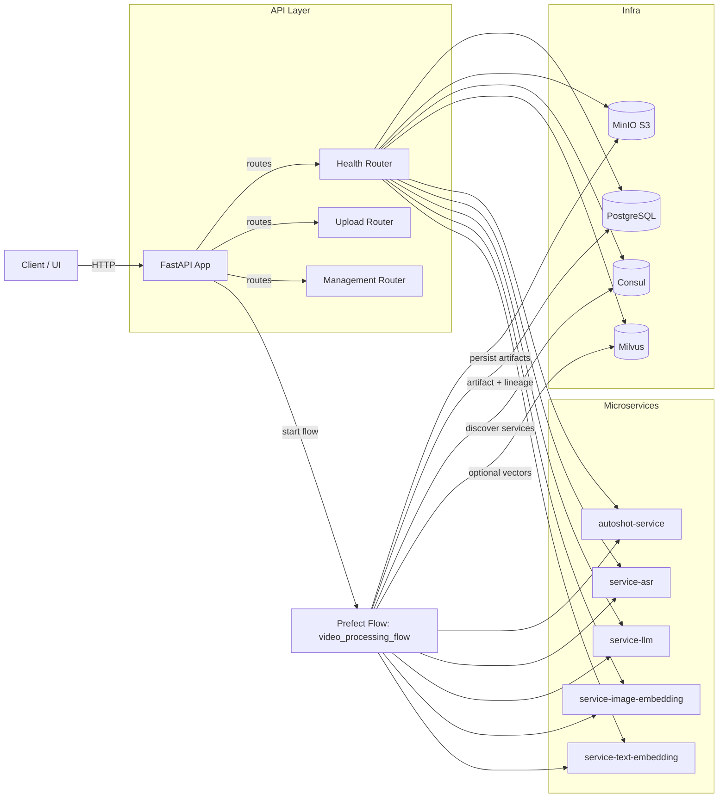
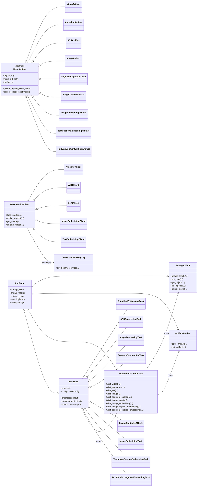
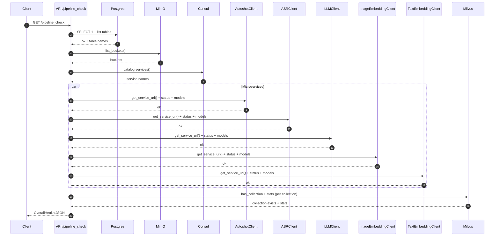

# Ingestion Service Architecture

This document describes the ingestion service architecture for end‑to‑end video processing: upload, analysis, captioning, embedding generation, and optional vector DB persistence.

## System Context

- API: FastAPI app (`main.py`) with lifecycle bootstrapping in `core/lifespan.py`.
- Orchestration: Prefect 3 tasks/flow (`flow/video_processing.py`).
- Storage: MinIO (S3 API) for all artifacts (`core/storage.py`).
- Lineage: PostgreSQL for artifact metadata + parent/child graph (`core/pipeline/tracker.py`).
- Vector DB: Milvus (optional) for embeddings.
- Discovery: Consul for microservice discovery (`core/pipeline/service_registry.py`).
- Microservices (via `prefect_agent/*`):
  - Autoshot (shot boundary detection)
  - ASR (speech‑to‑text)
  - LLM (captioning for segments and images)
  - Image Embedding
  - Text Embedding

Docker Compose (`docker-compose.yml`) brings up supporting infra (MinIO, Postgres, Consul, Milvus, Prefect) and the API + microservices.

## High‑Level Flow

1) Upload videos via `POST /uploads` with `files[]` and `user_id`.
2) Stage 1 — Video registry: originals are persisted to MinIO and registered in Postgres.
3) Stage 2 — Parallel branches:
   - Autoshot: detect shot segments per video.
   - ASR: transcribe audio per video.
4) Stage 3A — Segment captions: LLM generates captions per segment; then text embeddings for segment captions.
5) Stage 3B — Images and captions:
   - Extract N frames per segment.
   - LLM caption per image.
   - Embed each image + embed each image caption.
6) Optional — Persist embeddings to Milvus collections.
7) Management endpoints provide cascading deletes and status; health endpoints report component/microservice readiness.

All stages persist outputs to MinIO and insert artifact metadata + lineage edges in Postgres.

## API Surface

Routers under `api/*`:
- `POST /uploads/` — upload and start the Prefect flow (`api/upload.py`).
- `GET /management/videos/{video_id}/status` — roll‑up status from lineage (`api/management.py`).
- `DELETE /management/videos/{video_id}` — cascade delete video + descendants.
- `DELETE /management/videos/{video_id}/stages/{artifact_type}` — delete a whole stage subtree.
- `GET /pipeline_check` (+ sub‑routes) — health checks for DB, storage, Consul, microservices, Milvus (`api/health.py`).

CORS is open by default in `main.py` for ease of integration; adjust for production needs.

## Orchestration (Prefect)

Flow: `flow/video_processing.py` → `video_processing_flow(...)`
- Tasks use `AppState` (from `core/lifespan.py`) to access configured task instances and shared client config.
- Each task follows the pattern: `preprocess(input) → execute(client) → postprocess(output)` implemented via `BaseTask` (`core/pipeline/base_task.py`).
- Idempotency: Before heavy work, tasks call `artifact.accept_check_exist(visitor)` to avoid re‑processing/persisting duplicates.
- Parallelism: Autoshot and ASR run in parallel; the image branch fans out further for captions and embeddings.

Key tasks and inputs/outputs:
- `entry_video_ingestion` → `VideoArtifact[]`
- `autoshot_task` (`AutoshotArtifact[]`)
- `asr_task` (`ASRArtifact[]`)
- `image_processing_task` (`ImageArtifact[]`)
- `segment_caption_task` (`SegmentCaptionArtifact[]`)
- `image_caption_task` (`ImageCaptionArtifact[]`)
- `image_embedding_task` (`ImageEmbeddingArtifact[]`)
- `text_image_caption_embedding_task` (`TextCaptionEmbeddingArtifact[]`)
- `segment_text_caption_embedding_task` (`TextCapSegmentEmbedArtifact[]`)
- Optional Milvus persist tasks (currently commented in flow):
  - `image_embedding_milvus_persist_task`
  - `text_image_caption_milvus_persist_task`
  - `text_segment_caption_milvus_persist_task`

## Artifacts & Storage Layout

MinIO object keys are stable and derive from the artifact type and video/frame coordinates. See `core/artifact/schema.py`.
- Videos: `videos/{video_name}.{ext}`
- Autoshot segments: `autoshot/{video_name}.json`
- ASR transcripts: `asr/{video_name}.json`
- Images: `images/{video_name}/{frame_index}.webp`
- Image captions (JSON): `caption/image/{video_name}/{frame_index}.json`
- Embeddings:
  - Image: `embedding/image/{video_name}/{frame_index}.npy`
  - Image caption: `embedding/image_caption/{video_name}/{frame_index}.npy`
  - Segment caption: `embedding/caption_segment/{video_name}/{start}_{end}.npy`

Persistence is handled by `ArtifactPersistentVisitor` (`core/artifact/persist.py`):
- Uploads to MinIO and creates `ArtifactSchema` rows.
- Creates lineage rows in `ArtifactLineageSchema` when a parent exists.

## Database & Lineage

Implemented in `core/pipeline/tracker.py`:
- `artifacts_application` — id, type, `minio_url`, optional `parent_artifact_id`, `task_name`, timestamps.
- `artifact_lineage_application` — explicit parent→child edges with a `transformation_type`.

The status endpoint aggregates descendants per video id to compute stage completion and progress (`core/management/status.py`).

## Microservice Clients & Discovery

- Base client: `core/clients/base.py` with Consul discovery, retry/backoff, and timeouts.
- Service names resolved in Consul:
  - Autoshot: `autoshot-service`
  - ASR: `service-asr`
  - LLM: `service-llm`
  - Image Embedding: `service-image-embedding`
  - Text Embedding: `service-text-embedding`
- Endpoints per service follow the `/{service}/(infer|load|unload|models|status)` convention.

Consul integration is via `core/pipeline/service_registry.py`. Health endpoints under `/pipeline_check/services/*` exercise the same clients.

## Vector Database (Milvus)

- Optional persistence provided by tasks in `task/milvus_persist_task/*` and client in `core/clients/base.py` (`BaseMilvusClient`).
- Collection configs (dimensions, metrics, index type) are defined in `core/lifespan.py` and injected in app state:
  - `image_embeddings` (512‑D, COSINE, HNSW)
  - `text_caption_embeddings` (384‑D, COSINE, HNSW)
  - `segment_caption_embeddings` (512‑D, COSINE, HNSW)
- Health endpoints under `/pipeline_check/milvus/*` check collection existence and stats.

## Configuration

Environment variables (Pydantic settings in `core/config`):
- MinIO: `MINIO_HOST`, `MINIO_PORT`, `MINIO_ACCESS_KEY`, `MINIO_SECRET_KEY`, `MINIO_USER`, `MINIO_PASSWORD`, `MINIO_SECURE`.
- PostgreSQL: `POSTGRE_DATABASE_URL`.
- Milvus: `MILVUS_HOST`, `MILVUS_PORT`, `MILVUS_USER`, `MILVUS_PASSWORD`, `MILVUS_DB_NAME`.
- Consul: `CONSUL_HOST`, `CONSUL_PORT`.
- Prefect: `PREFECT_API_URL` (for server/worker inside Compose).

Task defaults (devices/models/batch sizes) are set in `core/lifespan.py` via task‑specific settings. For CPU‑only environments, change `device="cpu"` in the relevant settings before starting.

## Error Handling & Idempotency

- Clients use retry with exponential backoff; `ServiceUnavailableError` is raised when discovery fails.
- Tasks check artifact existence to avoid recomputation and duplicate persistence.
- Global FastAPI exception handler logs and returns 500 JSON.

## Observability

- Logging configured via `core/config/logging.py` (Loguru), file output at `logs/app.log`.
- Health checks: `/pipeline_check` plus DB/storage/Consul/microservices/Milvus subchecks.

## Extensibility

- New microservice:
  - Create a client by subclassing `BaseServiceClient` and define `service_name` + endpoints.
  - Register service in Consul with the expected name.
  - Create a `BaseTask` subclass to wrap the request/response and persistence logic.
  - Wire it in `core/lifespan.py` and invoke from the Prefect flow.
- New artifact type:
  - Add a Pydantic model to `core/artifact/schema.py` with `object_key`, `artifact_id`, `accept_upload`.
  - Extend `ArtifactPersistentVisitor` with a `visit_*` method.

## Security & Data Handling

- CORS is permissive by default; restrict `allow_origins` in `main.py` for production.
- MinIO access uses access/secret keys; ensure non‑default credentials in production.
- Uploaded media and derived artifacts may be sensitive; secure buckets and restrict presigned URL exposure to trusted clients.

## Known Notes

- The Prefect Milvus persist tasks are scaffolded and referenced in the flow but commented out; enable them as needed.
- Ensure NVIDIA Container Toolkit is installed when running GPU microservices; otherwise switch task configs to CPU.
- `docker-compose.yml` maps source directories into the `ingestion-api` container; changes reflect immediately when running `uvicorn --reload` inside the container.

## Diagrams

### High‑Level Components



### Upload Orchestration

```mermaid
sequenceDiagram
  autonumber
  participant C as Client
  participant A as API (FastAPI)
  participant B as BackgroundTasks
  participant F as Prefect Flow
  participant VI as VideoIngestionTask
  participant AU as AutoshotClient
  participant AS as ASRClient
  participant IMG as ImageProcessingTask
  participant LLM as LLMClient
  participant IE as ImageEmbeddingClient
  participant TE as TextEmbeddingClient
  participant S as MinIO (S3)
  participant DB as Postgres
  participant M as Milvus

  C->>A: POST /uploads (files[], user_id)
  A->>B: schedule run_flow_sync(run_id)
  A-->>C: 202 Accepted (run_id, tracking_url)

  B->>F: video_processing_flow(video_files, run_id, user_id)

  F->>VI: entry_video_ingestion(VideoInput)
  VI->>S: upload originals
  VI->>DB: insert VideoArtifact
  VI-->>F: VideoArtifact[]

  par Autoshot
    F->>AU: load_model(autoshot, device)
    F->>AU: POST /autoshot/infer (s3 url)
    AU-->>F: scenes [start,end]
    F->>S: put autoshot/{video}.json
    F->>DB: insert AutoshotArtifact + lineage
    F->>AU: unload_model()
  and ASR
    F->>AS: load_model(chunkformer, device)
    F->>AS: POST /asr/infer (s3 url)
    AS-->>F: transcript tokens
    F->>S: put asr/{video}.json
    F->>DB: insert ASRArtifact + lineage
    F->>AS: unload_model()
  end

  F->>LLM: load_model(gemini_api)
  F->>LLM: POST /llm/infer (segment ASR + images)
  LLM-->>F: segment captions
  F->>S: put caption/segment/*.json
  F->>DB: insert SegmentCaptionArtifact + lineage

  F->>IMG: extract frames
  IMG->>S: get video; put images/{video}/{idx}.webp
  IMG->>DB: insert ImageArtifact + lineage

  F->>LLM: POST /llm/infer (image)
  LLM-->>F: image captions
  F->>S: put caption/image/*.json
  F->>DB: insert ImageCaptionArtifact + lineage
  F->>LLM: unload_model()

  F->>IE: load_model(open_clip)
  F->>IE: POST /image-embedding/infer (images)
  IE-->>F: image embeddings
  F->>S: put embedding/image/*.npy
  F->>DB: insert ImageEmbeddingArtifact + lineage
  F->>IE: unload_model()

  F->>TE: load_model(mmbert)
  F->>TE: POST /text-embedding/infer (captions)
  TE-->>F: caption embeddings
  F->>S: put embedding/image_caption/*.npy
  F->>DB: insert TextCaptionEmbeddingArtifact + lineage
  F->>TE: unload_model()

  opt Optional: Milvus persistence
    F->>M: ensure collections + insert vectors
  end

  F-->>A: completion manifest
```

### Artifacts, Tasks, and Clients



### Health Check Sequence


